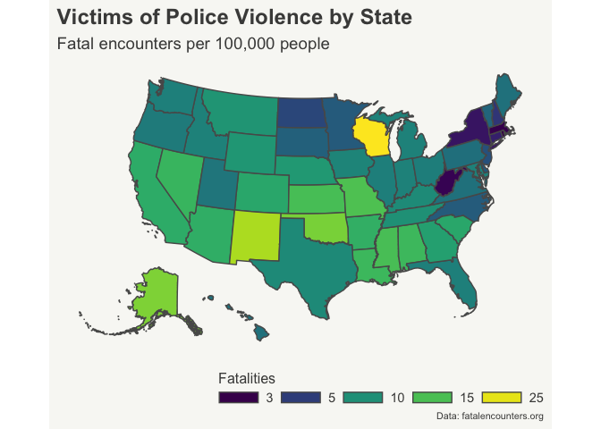

<!-- README.md is generated from README.Rmd. Please edit that file -->

# Mapping Fatal Police Encounters in the US

<!-- badges: start -->
<!-- badges: end -->

Is there any evidence of geographical or political trends? Where do we
see the highest, and lowest, rates of fatal police encounters?

<!-- -->

-   Higher rates of police fatal encounters are found predominantly in
    sun belt states. A possible explanation for this trend is the
    weather: people are more likely to be outside in areas with warmer
    climates, which in turn increases the probabilities they’ll have an
    encounter with the police. The exception to this trend is the state
    of Wisconsin, which actually has the highest rate of fatal police
    encounters with 25 fatalities per 100,000 people (as a reference,
    the national average is about 10 fatalities). When considering the
    social unrest that the state experienced after George Floyd’s murder
    Wisconsin’s fatal police encounters are not necessarily a surprise;
    nevertheless, we cannot determine what the main drivers are for
    these numbers in the state from this superficial graphical analysis.

-   The lowest fatality rates are primarily concentrated in Northeastern
    states - these numbers are no surprise either as the Northeast is a
    region characterized by having some of the strictest gun regulations
    in the country.

-   Conversely, a surprising find is we do not seem to find evidence of
    an association between fatal encounter rates and political divides.
    In other words, we don’t see any clear trends among blue or red
    states for higher or lower fatality rates.

<!-- -->

## Source

Data from [fatalencounters.org](https://fatalencounters.org)
