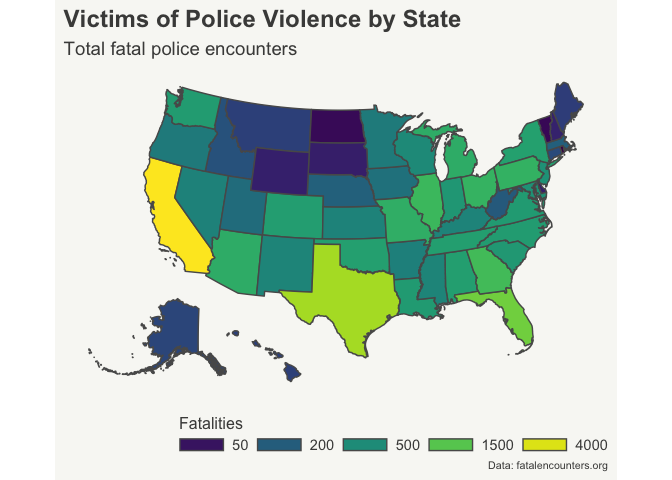

<!-- README.md is generated from README.Rmd. Please edit that file -->

# Mapping Fatal Police Encounters in the US

<!-- badges: start -->
<!-- badges: end -->

Is there any evidence of geographical or political trends? Where do we
see the highest, and lowest, rates of fatal police encounters?

<!-- -->

-   

The main state that stands out is Wisconsin, where the number of fatal
police encounters for every 100,000 people is about 25 - close to twice
the country average of 10 fatalities per 100,0000. An interesting
insight is the fatal encounter rate

No evident political trend

Wyoming is likely outlier, smaller population, so a small number of
fatal encounters has a big impact. Due to small population it is hard to
determine whether the proportionally high fatal encounters with police
rate is random, noise or if it is genuinely a state issue.

An important note is the map above uses a logged scale for fatalities
per 100,000 people. Due to Wyoming being an outlier state - with over
double the number per capita fatalities as the second closest state - it
is visually challenging to discern any significant variation among other
states when a leveled scale is used. This issue can be seen in the map
plotted below. Conversely, the variation among states is more apparent
when using a logged scale: we can see in which states the fatalities are
lower as a proportion to population and where they are higher. The
downside to the log scale is the lack of interpretability of the scale.
By comparing the legends from the two maps, we can generally assume the
log scale indicates how many times larger the fatality rate is in a
given state from the state with the lowest rate.

<!-- -->

## Source

Data from [fatalencounters.org](https://fatalencounters.org)
